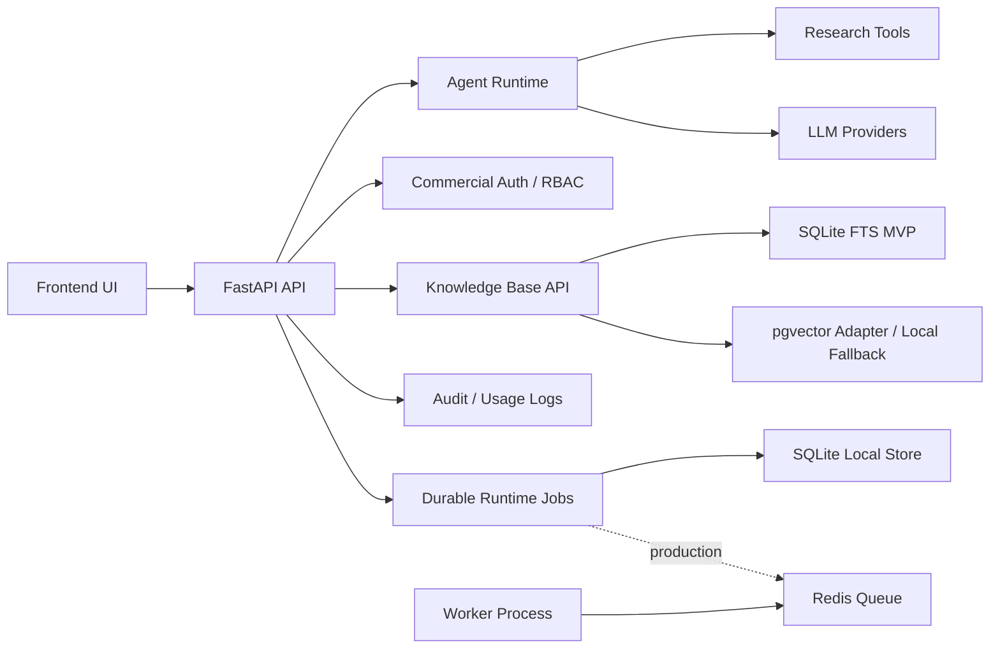

# Hyper Trading Agent

Hyper Trading Agent is a commercial-oriented financial research agent platform. It combines agent chat, market research tools, backtesting, model provider configuration, and a RAG knowledge base for private financial research workflows.

This repository is maintained as an independent project under `970thunder`.

## Current Capabilities

- Agent chat API with streaming session events.
- Financial research tools, market data integrations, report generation, and backtesting.
- SiliconFlow, OpenAI-compatible, OpenRouter, DeepSeek, Qwen/DashScope, Ollama, and other provider configuration surfaces.
- Local lightweight RAG using SQLite FTS for single-machine usage.
- Commercial platform MVP:
  - email/password auth
  - organizations and RBAC roles
  - model provider management
  - knowledge bases, documents, URL ingestion, search, and citations
  - audit logs and model usage API surfaces
- Organization trading and research workspaces:
  - read-only portfolio connections, retained snapshots, and drawdown history
  - configurable in-app/Webhook alerts with durable delivery records and retry controls
  - watchlists, cited market notes, earnings calendars, and event timelines
  - normalized OKX/Binance funding, open-interest, and basis metrics with provenance
  - paper-trading ledger with local risk limits and reproducible order replay
  - live connector workflow protected by mandate, approval, pre-trade checks, kill switch, and action audit
- Production deployment skeleton with Docker Compose, PostgreSQL + pgvector schema, Redis, API, and worker services.

## Architecture



## Local Setup

Backend:

```powershell
cd agent
copy .env.example .env
python -m cli serve --port 8899
```

Frontend:

```powershell
cd frontend
npm install
npm run dev
```

Open the frontend dev URL shown by Vite. The frontend proxies API traffic to the local backend.

## Model Configuration

For SiliconFlow, configure `agent/.env`:

```env
LANGCHAIN_PROVIDER=siliconflow
LANGCHAIN_MODEL_NAME=deepseek-ai/DeepSeek-V3.2
SILICONFLOW_BASE_URL=https://api.siliconflow.cn/v1
SILICONFLOW_API_KEY=your-api-key
```

Do not commit real API keys. Use local `.env` files or production secrets.

## Docker Deployment

Create production env:

```powershell
copy .env.production.example .env.production
```

Set at least:

- `POSTGRES_PASSWORD`
- `API_AUTH_KEY`
- `VIBE_TRADING_SECRET_KEY`
- `SILICONFLOW_API_KEY`

Runtime jobs default to the production queue contract in Docker:

```env
HYPER_TRADING_RUNTIME_JOB_BACKEND=redis-postgres
HYPER_TRADING_RUNTIME_JOB_QUEUE=hyper:runtime:jobs
```

Production RAG uses pgvector by default. Its vector dimension must match the
configured embedding model. The default SiliconFlow `BAAI/bge-m3` embedding
model uses 1024 dimensions:

```env
HYPER_TRADING_VECTOR_STORAGE=postgres-pgvector
HYPER_TRADING_PGVECTOR_DIMENSIONS=1024
```

Production knowledge metadata, documents, chunks, jobs, retrieval logs, and
organization-scoped `rag_vector_chunks` live in PostgreSQL. Local development
retains SQLite FTS and hashing embeddings as an explicit fallback when
PostgreSQL, `psycopg`, or the configured embedding endpoint is unavailable.

For multi-host API/worker deployments, keep original uploads in private
S3-compatible storage. The optional bundled MinIO profile mirrors every upload
to a tenant-scoped object key and lets a worker materialize it on demand before
parsing. Set the S3 variables in `.env.production` with
`HYPER_TRADING_OBJECT_STORAGE_BACKEND=s3`, use `http://minio:9000` as the
endpoint for bundled MinIO, and start it with:

```powershell
docker compose --profile object-storage --env-file .env.production -f docker-compose.prod.yml up --build -d
```

The bucket is private and is never exposed through a public object URL. When
S3 storage is configured, a failed durable write rejects the upload rather than
silently keeping the only source copy on a container volume.

Commercial persistence is migrated by domain. Production Compose uses
PostgreSQL as the primary source for identity, governance, knowledge lifecycle,
workspace ownership, and production vectors. An idempotent startup mirror
imports legacy SQLite records when a primary domain is first enabled. Keep the
`vibe-home` compatibility volume in backups during the migration period,
together with PostgreSQL and object/file storage.

For a single-machine deployment without Redis/Postgres workers, set `HYPER_TRADING_RUNTIME_JOB_BACKEND=sqlite-local`.

Start:

```powershell
docker compose --env-file .env.production -f docker-compose.prod.yml up --build -d
```

The production stack runs the idempotent SQL migration service and initializes named-volume ownership before starting the API and worker. The API port defaults to `127.0.0.1`; expose the service through `docker-compose.server.yml` and the Nginx gateway rather than binding the API directly to a public interface.

Initialize the first organization owner:

```powershell
$sfKey = (Select-String -Path .env.production -Pattern '^SILICONFLOW_API_KEY=').Line.Split('=',2)[1]
docker compose --env-file .env.production -f docker-compose.prod.yml exec api python -m src.commercial.bootstrap --email owner@example.com --password "change-this-password" --organization "Hyper Research" --api-key "$sfKey"
```

Commercial mode exposes only the sign-in screen to anonymous visitors. Public self-registration is disabled by default; create additional users through the organization administration console after signing in. Set `HYPER_TRADING_ALLOW_SELF_REGISTRATION=1` only for a controlled local development environment.

Organization Owner/Admin permissions apply only to their organization. The
process-wide settings, IM channels, scheduled jobs, and platform metrics are
reserved for Platform Admin users. Prometheus may scrape `GET /metrics` with
`Authorization: Bearer $API_AUTH_KEY`; this is the only operational data
endpoint that accepts a machine key instead of a signed-in session.

Stop:

```powershell
docker compose --env-file .env.production -f docker-compose.prod.yml down
```

For local HTTP access, set `VIBE_TRADING_COOKIE_SECURE=false` in `.env.production`. Use `true` only behind HTTPS/TLS. If host port `8899` is occupied, set `API_PORT=8898` or another free port.

Docker Desktop may present browser requests to the container as the bridge gateway address instead of `127.0.0.1`. For local-only Docker usage, keep `API_BIND=127.0.0.1` and `VIBE_TRADING_TRUST_DOCKER_LOOPBACK=1` so the bundled frontend can call protected API routes without a manual API key.

Operations runbooks:

- [Secret rotation and encryption migration](docs/operations-secret-rotation.md)
- [Backup and restore drill](docs/operations-backup-restore.md)
- [Server deployment guide](docs/deployment-server.md)
- [Automated server deployment](docs/deployment-automation.md)
- [服务器部署与自动发布中文教程](docs/server-deployment-tutorial.zh-CN.md)
- [宝塔面板镜像部署中文教程](docs/baota-image-deployment.zh-CN.md)
- [Prometheus and Grafana overlay](docs/deployment-server.md#optional-observability)
- [UI screenshot regression](docs/ui-screenshot-regression.md)

## Commercial API Surface

- `POST /auth/login`
- `POST /auth/logout`
- `GET /auth/me`
- `GET/POST /models/providers`
- `GET/POST /knowledge-bases`
- `POST /knowledge-bases/{id}/documents`, `/urls`, and `/search`
- `GET /organizations/current`
- `GET /models/providers`
- `POST /models/providers`
- `POST /models/providers/{id}/test`
- `GET /knowledge-bases`
- `POST /knowledge-bases`
- `POST /knowledge-bases/{id}/documents`
- `POST /knowledge-bases/{id}/urls`
- `POST /knowledge-bases/{id}/search`
- `GET /audit-logs`
- `GET /usage/model-calls`
- `GET/POST /portfolio/connections`
- `GET/POST /alerts/rules`, `GET/POST /alerts/channels`, `GET /alerts/deliveries`
- `GET/POST /research/watchlists`, `/research/notes`, `/research/events`
- `GET /market-data/crypto-derivatives`
- `GET/PUT /paper-trading/policy`, `GET/POST /paper-trading/orders`
- `GET /metrics`

## Current Limits

- Runtime jobs have a SQLite durable store and a Redis/Postgres queue contract. The worker can consume queued envelopes and update job state, but full Agent run, web crawl, and long-backtest executors still need to be moved onto that worker path.
- RAG supports PostgreSQL lifecycle storage, pgvector retrieval, local fallback, embedding status, ingestion lifecycle, and hybrid retrieval surfaces. Configurable reranking and formal RAG evaluation datasets remain follow-up work.
- CSRF protection, enterprise SSO, quota enforcement, and deeper observability hardening are still pending.
- Instrument metadata still needs authoritative corporate-action histories and exchange holiday calendars.
- Market-data quality still needs session-calendar enforcement, adjustment modes, gap annotations, and a freshness SLA.
- Webhook alert retries are durable and operator-dispatchable; production deployments should also schedule retry dispatch independently of request traffic.

## Verification

```powershell
python -m pytest agent\tests\test_commercial_store.py -q
cd frontend
npm run build
```

## Roadmap

1. Move Agent run, web crawl, RAG ingestion, and long backtest executors onto the durable Redis/Postgres worker path.
2. Retire the SQLite compatibility mirror after a completed migration window, rollback drill, and data-retention review.
3. Add rerank/evaluation loops for RAG and investment report quality.
4. Add enterprise SSO, quota enforcement, and stronger observability hardening.
5. Package private deployment runbooks, backup drills, and security review gates for commercial delivery.
