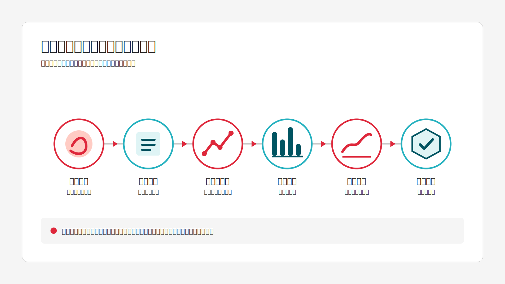
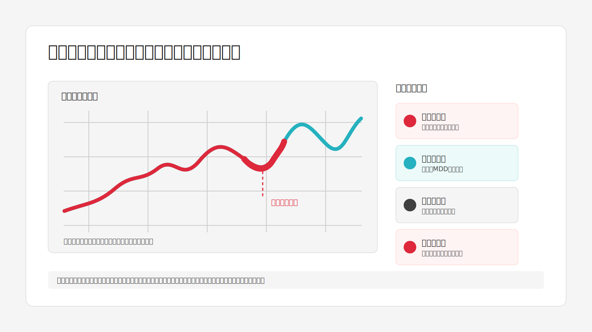
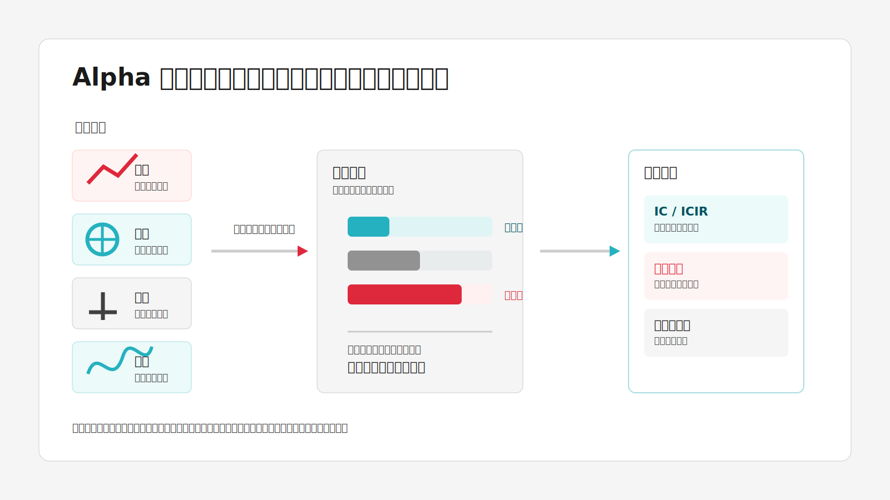
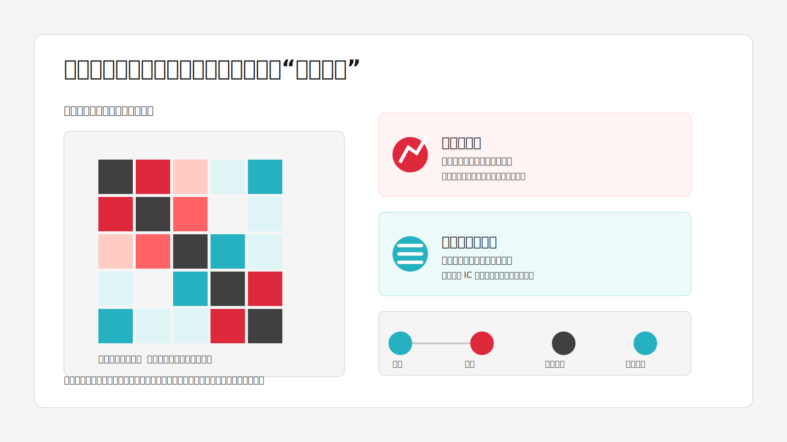

# Hyper Trading Agent 金融投研与量化基础手册

> 适用对象：希望正确使用 Hyper Trading Agent、理解回测报告、Alpha 因子库、相关性矩阵和量化研究流程的产品使用者、研究人员与开发人员。
>
> 本文用于金融知识教育和研究方法说明，不构成证券、期货、基金、数字资产或其他金融产品的投资建议。历史回测、因子检验和模型输出均不能保证未来收益。

## 目录

1. [量化投研与智能体在做什么](#量化投研与智能体在做什么)
2. [先建立共同语言](#先建立共同语言)
3. [回测与回测报告](#回测与回测报告)
4. [Alpha 因子与 Alpha 因子库](#alpha-因子与-alpha-因子库)
5. [相关性矩阵、皮尔逊相关与斯皮尔曼秩相关](#相关性矩阵皮尔逊相关与斯皮尔曼秩相关)
6. [从因子到组合](#从因子到组合)
7. [数据质量与常见研究陷阱](#数据质量与常见研究陷阱)
8. [Hyper Trading Agent 中的研究工作流](#hyper-trading-agent-中的研究工作流)
9. [如何阅读结果并提出正确的问题](#如何阅读结果并提出正确的问题)
10. [术语表、模板与延伸素材](#术语表模板与延伸素材)

## 量化投研与智能体在做什么

量化投研的核心不是“让模型猜涨跌”，而是把一个可检验的投资假设写成一套明确、可重复、可审计的过程：

1. 提出假设：例如“近期相对强势的股票，在下一个月仍可能相对更强”。
2. 定义数据：哪些股票、哪个市场、什么频率、何时可以获得数据。
3. 构造信号：把假设变成每只资产每天或每期的一个数值，即因子或交易信号。
4. 建立组合规则：买哪些、卖哪些、持仓多久、多久调仓、仓位如何分配。
5. 运行回测：在过去的可得数据上，按当时真实可执行的规则模拟交易。
6. 评估与反证：检查收益、风险、交易成本、稳定性、样本外表现和失败情形。
7. 形成可复现结论：记录数据版本、参数、代码、报告、风险假设与审计轨迹。

Hyper Trading Agent 的角色是研究协作者和工作流编排者。它可以理解研究问题、检索知识库、调用数据/回测/因子/多 Agent 工具、整理结构化报告，并保存执行记录；它不是收益承诺器，也不能绕过数据、交易制度和风险控制的约束。



*图 1：量化投研的完整链路。任一环节缺少时间边界、数据质量或风险复核，都会削弱最终结论。*

## 先建立共同语言

### 资产、标的池与投资期

- **资产或标的**：股票、ETF、期货合约、外汇、数字资产等可交易对象。
- **标的池（Universe）**：研究允许选择的资产集合，例如沪深 300 成分股、全 A 股、纳斯达克 100。标的池决定了结论适用范围。
- **频率**：日频、小时频、分钟频等。频率越高，数据、延迟、冲击成本和交易制度问题越重要。
- **持有期（Holding Horizon）**：信号产生后预计持有多久，如 1 日、5 日、20 日。
- **调仓频率（Rebalance Frequency）**：多久重新计算信号并调整持仓。持有期和调仓频率不是同一概念。
- **基准（Benchmark）**：用于比较策略表现的市场组合，如沪深 300、标普 500，或同等风险的替代组合。

### 收益、超额收益与净值

若价格从 Pₜ₋₁ 变为 Pₜ，简单收益率为：

**计算式：** rₜ = (Pₜ − Pₜ₋₁) ÷ Pₜ₋₁

策略净值通常以初始值 1 或 100 为基准，按每期收益连乘：

**计算式：** Vₜ = V₀ × ∏ᵢ₌₁ᵗ (1 + rᵢ)

- **绝对收益**：策略本身的收益。
- **超额收益**：策略收益减去基准收益，即 rₜ（超额）= rₜ（策略）− rₜ（基准）。
- **多头策略**：主要持有看涨资产；结果容易受到整体市场上涨影响。
- **多空策略**：同时买入高分组、卖出低分组，目的是更接近检验相对选股能力，而非市场方向。

## 回测与回测报告

### 什么是回测

回测（Backtest）是在历史数据中模拟一条策略：在每个历史时点只使用当时可获得的信息，按照策略规则生成交易、扣除成本，并计算资产曲线和风险指标。

回测回答的是：**“如果这套规则在这段历史里真实执行，且关键假设成立，可能会经历怎样的收益和风险？”** 它不回答“未来一定会怎样”。

一个可信回测至少要明确以下输入：

| 输入 | 必须说明的问题 |
| --- | --- |
| 标的池 | 是否包含退市股票、停牌股票、上市不足期股票？成分股是否按历史时点还原？ |
| 样本区间 | 起止日期是否覆盖上涨、下跌、震荡等不同市场状态？ |
| 信号与执行时点 | 用收盘价计算的信号，是当日收盘成交还是下一交易日成交？ |
| 交易规则 | 入场、离场、调仓、仓位上限、行业/风格约束、停损或风控规则是什么？ |
| 市场制度 | 涨跌停、T+1、停牌、最小交易单位、期货保证金与展期如何处理？ |
| 成本模型 | 佣金、税费、买卖价差、滑点、市场冲击如何计算？ |
| 基准与现金 | 用什么基准比较？未投资资金是否计入无风险利率？ |



*图 2：回测报告应同时呈现净值、回撤、成本与稳健性，而不能只展示收益曲线。*

### 回测报告包含什么

Hyper Trading Agent 的回测结果通常会产出运行记录、配置、指标、权益曲线、交易明细、日志和可下载产物。专业报告应把“结果”与“条件”放在同等重要的位置。

#### 1. 策略与样本摘要

应先看策略名称、市场/标的池、样本起止、初始资金、调仓频率、基准、成本假设、数据来源和运行版本。没有这些信息，单独的收益率没有解释价值。

#### 2. 收益指标

| 指标 | 含义 | 常见误读 |
| --- | --- | --- |
| 总收益率（Total Return） | 回测期内净值累计变化 | 不能跨不同长度区间直接比较 |
| 年化收益率（Annualized Return/CAGR） | 将不同长度回测换算为年均复合收益 | 短样本的年化会被放大 |
| 超额收益（Excess Return） | 相对基准多赚或少赚的收益 | 基准不合适时没有意义 |
| 月度/年度收益分布 | 收益在不同月份、年份的分布 | 平均值掩盖极端回撤和集中盈利 |
| 胜率（Win Rate） | 盈利交易或盈利期所占比例 | 胜率高不等于赚钱，关键还要看盈亏比 |
| 盈亏比（Payoff Ratio） | 平均盈利额与平均亏损额的比值 | 没有样本数量和成本时容易误导 |
| 盈利因子（Profit Factor） | 总盈利除以总亏损绝对值 | 极少数交易或尾部事件可显著扭曲该值 |

#### 3. 风险调整后收益

**波动率（Volatility）**衡量收益的离散程度。日收益率标准差常年化为：

**计算式：** σ（年化）= σ（日度）× √252

其中 252 是常见的年度交易日近似值，实际市场和频率应与之匹配。

**夏普比率（Sharpe Ratio）**衡量单位总波动获得的超额收益：

**计算式：** Sharpe = E(r − r_f) ÷ σ(r − r_f) × √N

其中 \(r_f\) 为无风险收益率，\(N\) 为年化周期数。夏普高通常意味着单位波动下回报较好，但它假设上下波动同样“不好”，并对非正态收益、期权型收益和短样本不够稳健。

**索提诺比率（Sortino Ratio）**只惩罚下行波动：

**计算式：** Sortino = E(r − r_f) ÷ σ（下行，r − r_f）× √N

它适合关注下行风险的研究，但同样依赖阈值、频率和样本质量。

#### 4. 回撤与尾部风险

设净值历史最高点 Hₜ = max(V₀, …, Vₜ)，当前回撤为：

**计算式：** DDₜ = Vₜ ÷ Hₜ − 1

**最大回撤（Maximum Drawdown, MDD）**是整个区间中最深的 DDₜ。它回答“从峰值到谷值最惨时亏了多少”，是实务中比单纯波动率更直观的风险指标。

还应查看：

- 回撤持续时间：亏损后多久恢复到新高。
- 回撤发生在哪个市场环境：系统性熊市、流动性冲击还是策略自身失效。
- 收益是否集中在少量日期或单一资产。
- 卡玛比率（Calmar Ratio）：常近似为年化收益率除以最大回撤绝对值，用于比较回撤效率；短样本下同样不稳定。

#### 5. 交易与可执行性指标

| 指标 | 作用 |
| --- | --- |
| 交易次数 | 交易过少时统计可信度低；交易过多时成本更敏感 |
| 换手率（Turnover） | 组合在一个周期内替换的比例；换手高意味着滑点和冲击成本更重要 |
| 持仓数与集中度 | 判断是否依赖极少数标的，常看最大权重、行业暴露、HHI 等 |
| 持有期 | 影响成本、容量和信号衰减判断 |
| 成交假设 | 是否以收盘、开盘、VWAP 或下一期价格成交 |
| 容量（Capacity） | 策略在资金规模增大后是否还能以假定价格成交 |

### 如何读一份回测报告

建议顺序不是先看总收益，而是：

1. 看样本和数据是否可信。
2. 看交易时点与成本是否现实。
3. 看最大回撤、回撤期和极端月份是否可承受。
4. 看相对基准与不同市场状态下是否稳定。
5. 看换手、成交量约束和容量。
6. 最后才综合看年化收益、夏普、胜率、盈利因子。

一个“年化高、夏普高”但只覆盖一年、没有成本、使用当日收盘信号当日收盘成交、没有退市股票处理的回测，通常不能直接用于投资决策。

## Alpha 因子与 Alpha 因子库

### 什么是 Alpha

在量化选股语境里，**Alpha 因子**是一个给每只资产打分的函数，希望这个分数能对未来收益、风险或相对表现提供增量信息。它不是一个完整策略，更不是保证获利的“秘密公式”。

例子：

- 动量：过去 20 日涨幅更高的股票，分数更高。
- 价值：估值更低的股票，分数更高。
- 质量：盈利能力、现金流质量或资产负债表更稳健的股票，分数更高。
- 低波动：过去波动较低的股票，分数更高。
- 流动性/微观结构：成交量、换手、价量关系、买卖压力等衍生信号。

一个因子在日期 t 对股票 i 的值可写为 fᵢ,ₜ。研究通常检验它与未来 h 期收益 rᵢ,ₜ→ₜ₊ₕ 的关系。

### 因子、信号、策略的区别

| 概念 | 是什么 | 例子 |
| --- | --- | --- |
| 因子 | 一个可计算的特征或分数 | 20 日收益率、PE 倒数、5 日量价相关性 |
| 信号 | 将因子处理后用于决策的结果 | 因子排名前 10% 做多、后 10% 做空 |
| 策略 | 信号加上组合、交易、风险和成本规则 | 每周调仓、行业中性、单票上限 2%、扣除成本的多空组合 |

### Alpha 因子库（Alpha Zoo）是什么

Alpha 因子库是因子公式、元数据、计算算子、适用市场和研究结果的可检索集合。它的价值在于：

- 避免从零重复发明常见信号。
- 提供可复现的公式与计算语义。
- 便于批量评测、横向比较、去重和组合研究。
- 让 Agent 可以根据研究任务调用候选因子，而不是凭语言模型记忆编造公式。



*图 3：多个候选信息经过清洗、排序和检验后，才能成为有待进一步组合研究的因子证据。*

本项目的 Alpha Zoo 目前包含多个来源族群，例如：

| 因子族 | 大致特点 | 使用提醒 |
| --- | --- | --- |
| Alpha101 | 常见的短周期价量、排名、相关性和衰减算子公式 | 公式公开不等于对当前市场仍有效 |
| GTJA191 | 面向中国 A 股语境的技术与微观结构类因子集合 | 必须结合 A 股涨跌停、停牌、T+1 等规则 |
| Qlib158 | 一组常用价量衍生特征，如均线、变化率、滚动极值、相关性等 | 多数是特征库，仍需建模或排序规则 |
| Academic | 学术资产定价风格因子或其可计算代理，如市场、规模、价值、动量、盈利、投资等 | 代理实现未必等同原论文的严格定义 |

### 因子计算中的常见算子

| 算子 | 含义 | 例子 |
| --- | --- | --- |
| `delta(x, n)` | 当前值减去 n 期前的值 | 5 日价格变化 |
| `rank(x)` | 截面排序或百分位排序 | 每天把股票按因子从低到高排序 |
| `ts_rank(x, n)` | 在自身过去 n 期内排序 | 今日成交量处于过去 20 日什么位置 |
| `mean/std/min/max` | 滚动均值、标准差、最小、最大 | 20 日均线、20 日波动率 |
| `corr(x, y, n)` | 滚动相关性 | 过去 10 日价格与成交量的相关性 |
| `decay_linear(x, n)` | 对近期数据给予更高权重的线性衰减 | 让最新信号影响更大 |
| `scale(x)` | 将向量按某种总暴露缩放 | 控制组合信号的总绝对权重 |

任何公式都需要先确认：输入字段定义是什么、是否复权、窗口是否足够、缺失值如何处理、截面排序是在全市场还是行业内进行。

### 如何检验一个因子

#### 1. 信息系数 IC

**IC（Information Coefficient）**通常指某一期横截面因子值与未来收益之间的相关系数。若分数越高的股票在未来平均收益越高，则 IC 倾向为正。

常见定义：

**计算式：** ICₜ = corr(fᵢ,ₜ, rᵢ,ₜ→ₜ₊ₕ)

对一段时间的 \(IC_t\) 序列，可统计：

- 平均 IC：平均预测方向是否为正。
- IC 标准差：信号稳定性。
- ICIR：\(mean(IC)/std(IC)\)，常被称为 IC Information Ratio。
- IC 正值比例：多少期方向正确。
- IC 衰减：预测 1 日、5 日、10 日、20 日未来收益时，IC 如何变化。

IC 很小也可能有价值，因为截面选股本身噪声很大；但它必须在足够样本、不同市场状态和合理成本下持续出现，不能只挑选最好看的窗口。

#### 2. 分组收益与多空收益

将每期股票按因子从低到高分为 5 或 10 组，观察各组未来收益。一个有方向性的因子通常表现为单调的分组收益结构：高分组优于低分组，或相反。

- **多头分组收益**：买高分组。
- **多空分组收益**：买高分组、卖低分组，减少整体市场方向影响。
- **行业/市值中性**：先在行业或市值桶内排序，降低因子只是“行业偏好”或“大小盘暴露”的可能。

#### 3. 换手、衰减与成本

一个因子即使 IC 很高，如果每日排名变化剧烈，实际交易成本可能吞噬收益。因子检验必须同时看：

- 调仓后的预测期收益。
- 持有期与信号衰减速度。
- 分组换手率。
- 不同成本假设下的净收益。
- 在流动性差、涨跌停、停牌标的上的可执行性。

### 因子预处理为何重要

原始因子值经常包含异常值、量纲差异和行业暴露。常见处理包括：

1. **去极值（Winsorization）**：限制极端值影响。
2. **标准化（Z-score）**：z = (x − μ) ÷ σ，便于不同因子比较。
3. **截面排序（Rank）**：只关心相对次序，对异常值更稳健。
4. **缺失值处理**：明确剔除、填充还是不可交易。
5. **中性化（Neutralization）**：回归或分组去除行业、市值、Beta 等已知风险暴露。
6. **正交化/去相关**：减少与已有因子高度重复的部分。

不能先试遍所有处理方式再只保留最佳结果而不记录过程，这属于数据窥探，会高估真实效果。

## 相关性矩阵、皮尔逊相关与斯皮尔曼秩相关

### 什么是相关性矩阵

相关性矩阵把多个资产、因子或策略两两之间的相关系数排成方阵。若有 n 个对象，就得到 n × n 矩阵。其结构可写为：

```text
C = [[1,   ρ₁₂, …, ρ₁ₙ],
     [ρ₂₁, 1,   …, ρ₂ₙ],
     [ …,  …,  …,  … ],
     [ρₙ₁, ρₙ₂, …, 1  ]]
```

相关系数范围通常在 \([-1,1]\)：

- 接近 `+1`：两者经常同向变动。
- 接近 `0`：没有明显的线性或单调共同变化，不代表绝对独立。
- 接近 `-1`：两者经常反向变动。

在 Hyper Trading Agent 的相关性矩阵页面中，可输入多个标的、设置回看窗口，并在皮尔逊与斯皮尔曼方法之间选择。它常用于资产配置、策略去重、风险暴露诊断和对冲候选筛选。



*图 4：相关性矩阵揭示的是共同风险结构；低相关需要在滚动窗口和压力期中继续验证。*

### 皮尔逊相关（Pearson Correlation）

皮尔逊相关系数衡量两个变量的**线性关系**：

**计算式：** ρₓ,ᵧ = Cov(X, Y) ÷ (σₓ × σᵧ)

其中 Cov(X, Y) 是协方差，σₓ、σᵧ 是标准差。

直观例子：若资产 A 的日收益每增加 1%，资产 B 平均也按近似固定比例增加，皮尔逊相关会较高。

**适合的情况**：

- 分析收益率、因子暴露等连续数值的线性共同变动。
- 进行均值-方差优化、协方差估计和传统组合风险计算。
- 数据关系接近线性、极端值已处理或需要保留极端风险的影响。

**局限**：

- 对极端值敏感。一次市场暴跌可能显著改变结果。
- 只能刻画线性关系。U 型、阈值型关系可能显示为低相关。
- 不能说明因果关系，也不能保证未来相关性稳定。

### 斯皮尔曼秩相关（Spearman Rank Correlation）

斯皮尔曼秩相关先把观测值转换为名次，再计算名次之间的皮尔逊相关。它衡量的是**单调关系**：一个变量变大时，另一个变量是否总体上趋于变大或变小，而不要求增量呈直线比例。

无并列名次时可写为：

**计算式：** ρₛ = 1 − [6 × Σ(dᵢ²)] ÷ [n × (n² − 1)]

其中 \(d_i\) 为第 \(i\) 个观测在两个变量中的名次差。实际实现通常采用“对秩后的序列计算皮尔逊相关”，以正确处理并列名次。

**适合的情况**：

- 因子研究中的横截面 IC：因子高低和未来收益高低的相对顺序往往比精确数值更稳健。
- 数据有异常值、偏态、非正态分布，或者只相信排序信息。
- 希望检验“高分更好/更差”的单调关系。

**局限**：

- 牺牲幅度信息：从第 1 名到第 2 名与第 1 名到第 100 名的数值差距不会直接保留。
- 依然不能处理非单调关系，也不代表因果。
- 样本很少、并列名次很多时解释会变弱。

### 两者如何选择

| 问题 | 优先方法 | 原因 |
| --- | --- | --- |
| 两只资产收益的线性联动有多强？ | 皮尔逊 | 组合协方差和线性风险模型通常使用它 |
| 因子分数越高，未来收益排序是否越靠前？ | 斯皮尔曼 | 对排序和异常值更稳健，符合截面选股语境 |
| 数据有少量极端收益日，想检查稳健性 | 两者都看 | 若差异很大，说明结果受幅度或异常值影响 |
| 关系可能是阈值/U 型 | 两者都不够 | 用散点图、分箱/分组、非线性模型或互信息补充 |

### 相关性在投资中的用途

1. **分散化**：寻找低相关或负相关的资产/策略，降低组合同时亏损的概率。
2. **因子去重**：两个因子高度相关，往往在捕捉相似信息；都加入模型未必增加有效信息。
3. **风格暴露诊断**：检查策略是否与市场、成长、价值、动量、行业或某类资产高度同向。
4. **风险预算**：高相关持仓会在压力时期共同下跌，名义上持仓很多不等于真正分散。
5. **对冲研究**：寻找在特定风险因子上相反或低相关的候选工具。

重要提醒：危机时期的相关性常会上升，平时低相关的资产可能在流动性紧张时一起下跌。因此不能只看一个固定窗口的平均相关性，应查看滚动相关、压力期表现和尾部联合损失。

## 从因子到组合

因子有预测能力，不等于可以直接交易。因子要经过组合构建，常见步骤如下：

1. 计算并清洗多个候选因子。
2. 标准化、行业/市值中性化、处理缺失与异常。
3. 根据 IC、分组收益、稳定性和经济逻辑筛选。
4. 检查因子间相关性，避免重复暴露。
5. 合成综合分数，或用模型预测未来收益/风险。
6. 在约束下优化权重：单票、行业、风格、杠杆、流动性、换手和风险预算。
7. 以真实交易成本和制度规则回测。

### 协方差与组合风险

组合权重记为 \(w\)，资产协方差矩阵记为 \(\Sigma\)。组合方差为：

**计算式：** σₚ² = wᵀ × Σ × w

这说明风险不仅由单只资产波动决定，也由资产之间的共同波动决定。相关性矩阵是协方差矩阵的重要组成部分：

**计算式：** Cov(i, j) = ρᵢⱼ × σᵢ × σⱼ

低相关有助于分散风险，但前提是相关估计可靠、资产可交易、风险暴露没有被其他共同因子掩盖。

### 常见组合方法

| 方法 | 核心思想 | 风险点 |
| --- | --- | --- |
| 等权 | 每个标的相同权重 | 忽略波动与相关性，可能过度暴露高波动标的 |
| 市值权重 | 按规模配置 | 容易集中到大市值资产 |
| 逆波动/风险平价 | 波动高的资产少配 | 依赖历史波动稳定性，未必处理相关性 |
| 均值-方差优化 | 在预期收益和协方差下求最优权重 | 对预期收益和协方差估计极其敏感 |
| 分层/行业中性选股 | 在行业或风格桶内比较 | 约束可能降低可实现收益，也增加换手 |

## 数据质量与常见研究陷阱

### 最重要的时间原则：不能看未来

**前视偏差（Look-ahead Bias）**：在 \(t\) 时点的策略使用了当时尚未公开、修订后才知道或在实际中无法成交的数据。例如，用当天收盘价计算信号又假设当天收盘成交。

应明确数据可用时间与成交时间：

```text
T 日收盘后可得到的完整数据
    -> T+1 日开盘或 T+1 日 VWAP 执行
    -> 从 T+1 开始计算持仓收益
```

### 其他高频错误

| 问题 | 含义 | 后果 | 修复方向 |
| --- | --- | --- |
| 幸存者偏差 | 只使用今天还存在的股票 | 高估历史表现 | 使用点时（point-in-time）成分股和退市数据 |
| 复权错误 | 分红、拆股、配股处理不一致 | 价格和收益失真 | 明确前复权、后复权或总回报口径 |
| 数据修订偏差 | 使用事后修订的财务/宏观数据 | 信息可得时间错误 | 保存公告时点和历史版本 |
| 成本过低 | 忽略佣金、税费、滑点、冲击 | 高频策略虚假盈利 | 做多档成本敏感性分析 |
| 过拟合 | 参数/规则为历史噪声量身定制 | 样本外失效 | 简化模型、减少试验自由度、样本外验证 |
| 数据窥探 | 尝试大量因子后只报告最优者 | 显著性被夸大 | 记录全部实验、做多重检验和独立验证 |
| 基准不当 | 与不匹配的指数或未扣风险比较 | 结论不可比 | 选择可投资、同市场、同约束的基准 |
| 忽略交易制度 | 涨跌停、停牌、T+1、期货展期未建模 | 回测不可执行 | 由具体市场引擎和规则模拟 |

### 样本内、样本外与滚动验证

- **样本内（In-sample）**：用于提出和调参。结果通常偏乐观。
- **样本外（Out-of-sample）**：调参后不再触碰的验证区间，更接近真实泛化检验。
- **Walk-forward / 滚动验证**：按时间多次“训练一段、验证下一段”，适合非平稳金融数据。
- **压力测试**：专门检验危机、高波动、流动性收缩、政策变化等时期。

研究结论应写成条件句，例如“在 2016-2024 年、沪深 300、周频调仓、双边成本 20bp、行业中性约束下，该信号的多空净收益和 IC 表现为……”。这种表述比“该策略有效”更专业也更可审计。

## Hyper Trading Agent 中的研究工作流

### 功能地图

| 系统模块 | 金融研究中的作用 | 应看什么 |
| --- | --- | --- |
| 智能体对话 | 将研究问题拆成数据、因子、回测、报告任务 | 模型、知识库范围、执行模式、步骤时间线 |
| 多 Agent | 将筛选、因子研究、回测、风险审计等职责分工 | 每个 Agent 的模型、工具权限与运行记录 |
| Alpha 因子库 | 浏览、检验、对比候选因子 | 公式、元数据、IC、IR、分组和适用市场 |
| 相关性矩阵 | 研究资产或策略的共同波动 | 标的、窗口、方法、滚动/压力期差异 |
| 运行时 | 查看长回测、因子评测、RAG 导入等后台任务 | 进度、日志、产物、失败与重试 |
| 报告与运行详情 | 沉淀可复现研究结论 | 配置、指标、图表、交易、工具调用、文件 |
| 知识库 / RAG | 管理投研制度、研究报告、公告、策略文档等证据 | 引用、来源、分片、向量化与检索质量 |

### Agent 应遵循的研究链路

1. **澄清问题**：目标是选股、资产配置、风险诊断还是策略回测？市场、频率、区间、成本和约束是什么？
2. **检索证据**：从知识库或可信数据源读取定义、制度、公司文件、已有研究，不把未验证文本当事实。
3. **制定计划**：复杂任务使用 Plan-Execute，将数据检查、因子构建、回测、风险审计拆成独立步骤。
4. **调用工具并留痕**：数据、RAG、回测、因子、文件等操作应显示状态、耗时、输入摘要、输出摘要和产物。
5. **形成结构化输出**：区分事实、假设、方法、结果、风险、限制与下一步；引用知识库结论的来源。
6. **人类复核（HITL）**：高风险操作、写文件、交易相关操作或成本较高的任务应进入审批或受控流程。

### RAG 在金融投研中的正确位置

RAG（检索增强生成）可以让 Agent 在回答前从组织知识库检索相关内容。它适合：

- 公司研究模板、投研制度、风控阈值、合规要求。
- 内部历史报告、会议纪要、策略说明、财务公告文本。
- 数据字典、字段口径、交易规则和操作手册。

RAG 不会自动验证来源是否真实、是否过期或是否适用于当前市场。高质量知识库需要文档来源、时间、权限、版本、分片、引用和更新生命周期；回答中出现引用，也不等于投资结论已经被验证。

### 记忆与上下文

- **会话上下文**：当前任务的目标、已做步骤、数据与中间结论。
- **持久记忆**：用户偏好、长期研究偏好、经明确确认后保存的工作习惯。
- **检索记忆**：从历史会话或知识库找回与本题相关信息。
- **上下文压缩**：长对话要压缩，但不能丢失任务目标、已完成步骤、关键参数、文件路径、未决问题和风险提示。

金融场景尤其要避免把 API 密钥、个人隐私、未公开重大信息或未经授权的客户数据写入普通记忆或公开知识库。

## 如何阅读结果并提出正确的问题

### 因子评测后的提问清单

- 该因子的定义、输入字段、方向和经济逻辑是什么？
- 使用的是皮尔逊 IC 还是斯皮尔曼 IC？预测期是几天？
- IC、ICIR、正 IC 比例、分组收益和换手分别是多少？
- 是否行业/市值中性？是否去极值和标准化？
- 在不同年份、牛熊震荡期、不同市值/行业中是否稳定？
- 与现有因子的相关性高吗？加入组合后是否仍有边际价值？
- 交易成本提高一倍、延迟一期或限制流动性后是否还成立？

### 回测后的提问清单

- 策略用的每个数据在信号时点是否真实可得？
- 成本、滑点、涨跌停、停牌、T+1 等是否已建模？
- 收益来自哪个阶段、哪些标的、哪类市场环境？
- 最大回撤与恢复期是什么？能否承受？
- 对参数、持有期、调仓频率和样本起点是否敏感？
- 样本外、滚动验证和压力期表现如何？
- 与基准、可替代策略和简单等权组合相比，优势在哪里？

### 可直接给 Agent 的高质量任务示例

```text
请在沪深 300 历史成分股范围内研究 20 日动量因子：
1. 使用 2016-2022 年作为样本内、2023-2025 年作为样本外；
2. 每周调仓，信号在 T 日收盘计算、T+1 日开盘执行；
3. 行业中性，单票权重不超过 2%，双边交易成本按 20bp；
4. 输出斯皮尔曼 IC、ICIR、5 分组收益、多空收益、换手和回撤；
5. 比较成本为 10bp、20bp、40bp 的敏感性；
6. 明确列出数据来源、缺失值处理、限制和未验证假设。
```

```text
请比较 CSI 300 ETF、黄金 ETF、10 年期国债 ETF 的过去 3 年日收益相关性：
同时给出皮尔逊与斯皮尔曼矩阵、90 日滚动相关、压力阶段的变化，
并说明低相关是否真的带来组合分散化，不要给出买卖建议。
```

## 术语表、模板与延伸素材

### 常用术语表

| 术语 | 简明解释 |
| --- | --- |
| Alpha | 期望提供增量预测信息的因子或策略收益来源 |
| Beta | 对市场或系统性风险因子的暴露 |
| IC | 因子值与未来收益的横截面相关性 |
| ICIR | 平均 IC 除以 IC 标准差，衡量 IC 稳定性 |
| 因子暴露 | 组合对某个因子的敏感程度 |
| 多空 | 同时买入预期高收益组、卖出低收益组 |
| 市场中性 | 尽量降低整体市场 Beta 暴露 |
| 年化 | 将某个频率或周期的指标折算为年尺度 |
| 波动率 | 收益离散程度，常用标准差表示 |
| 夏普比率 | 单位总波动获得的超额收益 |
| 最大回撤 | 净值从历史峰值到后续谷值的最大跌幅 |
| 回撤恢复期 | 从回撤开始或谷底回到前高所需时间 |
| 换手率 | 某期内组合交易/替换的程度 |
| 滑点 | 实际成交价相对理想价格的不利偏离 |
| 市场冲击 | 大额交易本身推动价格造成的成本 |
| 容量 | 策略在更大资金规模下仍能执行的能力 |
| 标的池 | 可参与研究或交易的资产集合 |
| 复权 | 调整除权、分红、拆股等公司行为后的价格口径 |
| 前视偏差 | 使用了决策时点不可能获得的信息 |
| 幸存者偏差 | 忽略已退市或消失标的造成的偏差 |
| 样本外 | 未用于模型选择和调参的独立验证区间 |
| 过拟合 | 模型拟合历史噪声而非可持续规律 |
| 相关性 | 两变量共同变化的统计程度，不代表因果 |
| 协方差 | 两变量共同偏离各自均值的程度 |
| 皮尔逊相关 | 衡量线性关系的相关系数 |
| 斯皮尔曼相关 | 衡量排序单调关系的秩相关系数 |
| RAG | 检索增强生成，先检索组织知识再生成回答 |
| HITL | Human-in-the-loop，人类审批或复核节点 |

### 推荐学习路径

1. 先掌握收益、净值、回撤、交易成本和基准。
2. 再学习因子、IC、分组回测、行业中性化与换手。
3. 接着理解相关性、协方差、组合风险与分散化。
4. 最后学习样本外验证、过拟合控制、组合优化和真实交易约束。

### 建议参考素材

- Grinold & Kahn, *Active Portfolio Management*：因子、IC、主动管理与组合构建。
- Cochrane, *Asset Pricing*：资产定价与风险因子基础。
- Chan, *Quantitative Trading*：量化交易与实践约束入门。
- López de Prado, *Advances in Financial Machine Learning*：金融机器学习、验证与回测偏差。
- CFA Institute 的 Portfolio Management、Quantitative Methods 学习材料：统计、风险与组合管理基础。
- 各交易所、基金公司、指数公司发布的指数编制与交易规则文档：用于确认具体市场制度和数据口径。

## 最后的实践原则

1. 先问“数据和时间是否真实可得”，再问“收益有多高”。
2. 先看回撤、成本、换手和样本外，再看夏普和年化。
3. 相关性低不等于危机时也能分散；因子 IC 高不等于组合可交易。
4. 一条漂亮曲线只是一条证据，不是结论。结论需要经济逻辑、统计稳健性、可执行性和持续审计共同支持。
5. 把 Agent 视为提高研究效率、可追溯性和覆盖面的工具；最终的投资判断、风险承担与合规责任仍需要人类负责。
